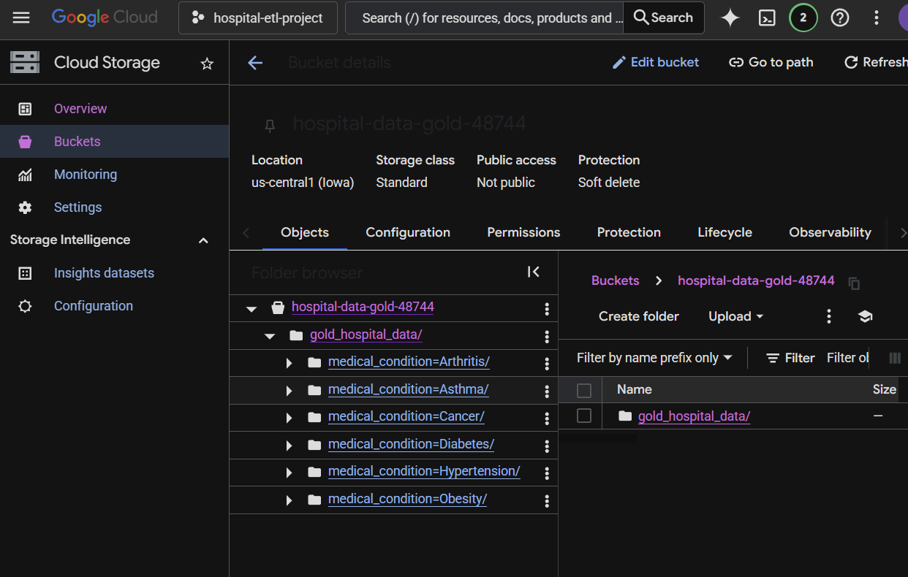
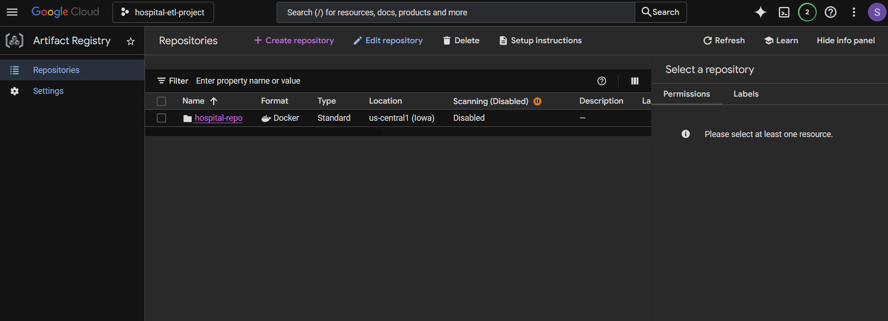
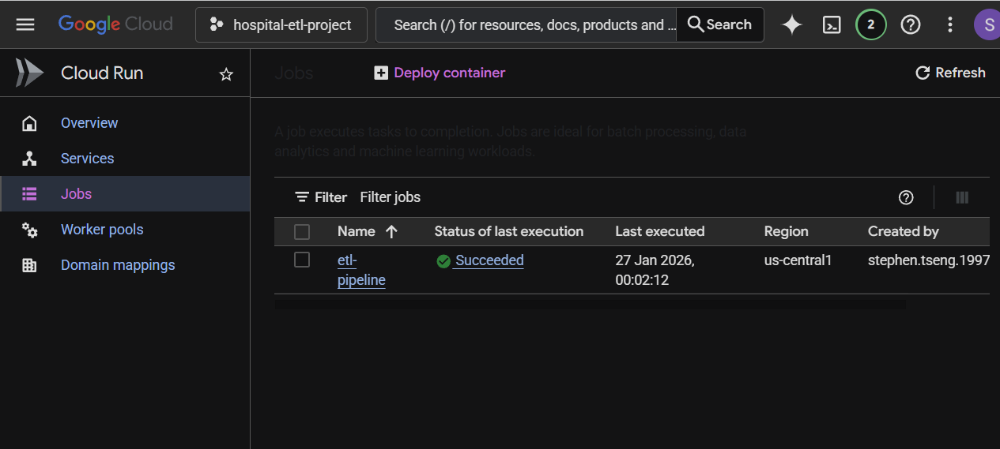

# Hospital Data ETL Pipeline (PySpark + Docker + Google Cloud)

A production-grade ETL pipeline that automates the ingestion, transformation, and cloud-delivery of hospital synthetic
data. This project showcases **PySpark** modularity, **Docker** containerization, and cost-optimized **Google Cloud**
deployment.

## Prerequisites & Local Setup

Replicating a Spark environment on a local machine (especially Windows) requires specific version matching and
environment configurations.

### 1. Python & Java Compatibility

* **Python 3.11**: Avoid 3.12+ to prevent Py4J connectivity issues.
* **Java JDK 17**: Spark requires a specific Java runtime.
    * **Download**: [Microsoft Java](https://learn.microsoft.com/en-us/java/openjdk/download).
    * **Env Var**: Set `JAVA_HOME` to your installation path (e.g., `C:\Program Files\Microsoft\jdk-17...`).

### 2. The Hadoop/Winutils "Missing Bin" Issue

**Issue**: When running Spark on Windows, you will likely see an error:
`java.io.IOException: Could not locate executable null\bin\winutils.exe`.
**Solution**:

1. **Download**: Get the Hadoop binaries (specifically `winutils.exe` and `hadoop.dll`) for your version from a trusted
   repository like [cdarlint/winutils](https://github.com/cdarlint/winutils/tree/master/hadoop-3.3.0/bin).
2. **Setup**:
    * Create a folder (e.g., `C:\hadoop`).
    * Create a `bin` folder inside it and place the downloaded files there.
    * **Env Var**: Create a system variable `HADOOP_HOME` pointing to `C:\hadoop`.
    * **Path**: Add `%HADOOP_HOME%\bin` to your System `Path`.

### 3. Kaggle API Data & Authentication

#### Data Source

[Hospital Data](https://www.kaggle.com/datasets/t0ut0u/hospital-excel-dataset?resource=download)

#### Authentication

Authentication is not neccesary for this dataset, but if needed you can authenticate for kaggle using the following:

1. Generate a `kaggle.json` from your [Kaggle Account Settings](https://www.kaggle.com/settings).
2. Set the following Environment Variables on your machine:
    * `KAGGLE_USERNAME`: Your Kaggle username.
    * `KAGGLE_KEY`: Your API Key.

---

## Project Architecture

This project follows a **Modular Design** to ensure the code is testable and cloud-ready.

* **`main.py`**: The entry point. Manages the SparkSession and environment orchestration.
* **`src/pipeline.py`**: The "Conductor." Defines the Bronze → Silver → Gold flow.
* **`src/cleanse_data.py`**: Pure Spark transformation logic (Feature Engineering).
* **`src/kaggle_data.py`**: Handles API ingestion and Excel-to-CSV conversion.
* **`src/gcp_utils.py`**: Custom utility to bridge local staging with Google Cloud Storage.
* **`notebooks/`**: Contains the initial Exploratory Data Analysis (EDA) and Spark prototyping.

---

## Containerization (Docker)

To solve "environment drift," the entire pipeline is containerized using a multi-layered Dockerfile.

### Local Testing with Docker Compose:

```bash
# Build the image
docker-compose build

# Run the pipeline (outputs to local /data folder)
docker-compose up

# Access the container shell for debugging
docker run -it --rm <img_name> /bin/bash
```

### Google Cloud Deployment (Free Tier)

Make sure to create a new project in GCP and enable billing (Free Tier should suffice).

#### Phase 1: Local Terminal Preparation

Before touching the Cloud Console, you must authenticate your local machine and prepare the container.

1. **Authenticate GCloud & Docker**

   Run these commands in your local terminal (PowerShell/CMD/Zsh) to give your computer permission to talk to your GCP
   project:

   ```bash
   # Log in to your Google Account (opens a browser tab)
   gcloud auth login

   # Set your active project
   gcloud config set project [YOUR_PROJECT_ID]

   # Authenticate Docker to push to Google's Registry
   gcloud auth configure-docker us-central1-docker.pkg.dev
   ```

2. **Build and Tag your Image**

   Use the existing `docker-compose.yml` to build. The image can be tagged, but in our case it is not necessary since we
   will
   push directly to the Artifact Registry, using the image name from the docker-compose (already an url).

   ```bash
   # Build using your local configuration
   docker compose build

   # Tag the image for Google Artifact Registry
   # Format: [LOCATION]-docker.pkg.dev/[PROJECT_ID]/[REPO_NAME]/[IMAGE_NAME]:[TAG]
   docker tag hospital-spark-etl-app us-central1-docker.pkg.dev/[PROJECT_ID]/hospital-repo/etl-pipeline:v1

   # Push the image to the cloud
   docker push us-central1-docker.pkg.dev/[PROJECT_ID]/hospital-repo/etl-pipeline:v1
   ```

#### Phase 2: Google Cloud Console (UI) Setup

Once the image is pushed, configure the cloud resources using the Console Interface.

1. **Create the Storage Bucket (The "Gold" Zone)**
    - **Search**: In the top search bar, type `Buckets` and select Cloud Storage.
    - **Create**: Click `[+] CREATE`.
    - **Name**: Enter a globally unique name (e.g., `hospital-data-gold-123`).
    - **Location**: Select Region and choose `us-central1 (Iowa)`.
    - **Storage Class**: Keep as Standard.
    - **Access Control**: Ensure Uniform is selected.
    - **Finalize**: Click `CREATE`.

   

2. **Create the Artifact Registry**
    - **Search**: Type `Artifact Registry`.
    - **Create**: Click `[+] CREATE REPOSITORY`.
    - **Name**: `hospital-repo`.
    - **Format**: Docker.
    - **Location Type**: Region → `us-central1`.
    - **Finalize**: Click `CREATE`. (This matches the path used in the docker tag command.)

   

   After pushing your image to Artifact Registry, you should see it listed:

   

3. **Create and Execute the Cloud Run Job**
    - **Search**: Type `Cloud Run` and click `Jobs` in the left sidebar.
    - **Create**: Click `[+] CREATE JOB`.
    - **Container Image URL**: Click `SELECT` and find the image you pushed (`v1`).
    - **Region**: `us-central1`.
    - **Settings** (Expansion Panel):
        - **Capacity**: Set memory to `2 GiB` (required for Spark).
        - **Variables**: Add the env variable `GCS_BUCKET_NAME` (bucket name).
    - **Finalize**: Click `CREATE`.

   

    - **Run**: Once created, click `EXECUTE` to start the pipeline. You can monitor execution logs:

   

   

#### Phase 2: Provisioning Infrastructure (CLI Version)

Instead of clicking through the UI, run these commands to create your resources.

1. **Enable Required APIs**

   ```bash
   gcloud services enable \
       artifactregistry.googleapis.com \
       run.googleapis.com \
       storage.googleapis.com
   ```

2. **Create Artifact Registry & Push Image**

   ```bash
   # Create the repository (UI: Artifact Registry > Create)
   gcloud artifacts repositories create hospital-repo \
       --repository-format=docker \
       --location=us-central1

   # Push the image (UI: Upload/Push)
   docker push us-central1-docker.pkg.dev/[YOUR_PROJECT_ID]/hospital-repo/etl-pipeline:v1
   ```

3. **Create the Storage Bucket**

   ```bash
   # Create the bucket (UI: Cloud Storage > Create Bucket)
   # Use 'Standard' storage and 'Uniform' access
   gcloud storage buckets create gs://[YOUR_BUCKET_NAME] \
       --location=us-central1 \
       --uniform-bucket-level-access
   ```

4. **Create and Execute the Cloud Run Job**

   ```bash
   # Create the Job (UI: Cloud Run > Jobs > Create Job)
   gcloud run jobs create hospital-etl-job \
       --image us-central1-docker.pkg.dev/[YOUR_PROJECT_ID]/hospital-repo/etl-pipeline:v1 \
       --region us-central1 \
       --memory 2Gi \
       --set-env-vars GCS_BUCKET_NAME=[YOUR_BUCKET_NAME],KAGGLE_USERNAME=[USER],KAGGLE_KEY=[KEY]

   # Execute the Job (UI: Click 'Execute')
   gcloud run jobs execute hospital-etl-job --region us-central1
   ```

---

### Troubleshooting Summary

* JAVA_HOME ErrorIncorrect Java versionEnsure Java JDK 17 is installed and JAVA_HOME is set.
* winutils.exe ErrorMissing Hadoop binaries on WindowsSet HADOOP_HOME and add /bin to
  Path.
* Py4JNetworkErrorPython 3.12+ incompatibilityDowngrade to Python 3.11.401
